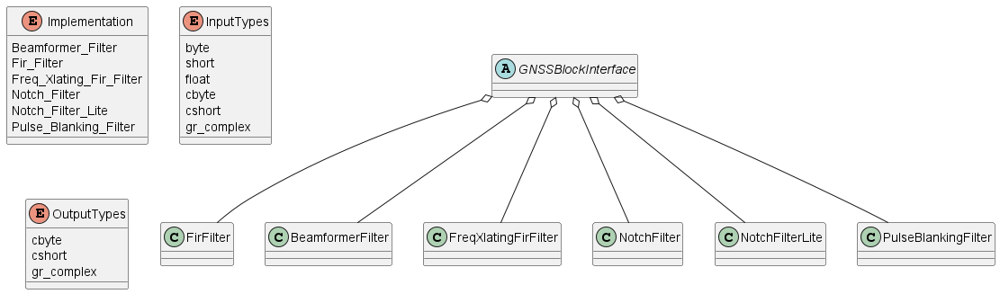

# Global Navigation Satellite System

[GNSS-SDR Github](https://github.com/gnss-sdr/gnss-sdr) is an open-source C++ project for acquiring, tracking and decoding position from GNSS signals.

A docker image is available by Carles Fernandez on DockerHub.

* ID: 5f7a5f7ef72a
* Disk Usage: 2.95GB
* Content Size: 653MB

~~~bash
  # pull a docker image of the software
  $ docker pull carlesfernandez/docker-gnsssdr

  # launch the container
  $ docker run -it --rm carlesfernandez/docker-gnsssdr:latest bash
~~~

First Fix Example

[First Fix](https://gnss-sdr.org/my-first-fix/) provides a tutorial of installing GNSS-SDR, configuring the receiver for a specific recording.

* [GNSS Signal in Spain - 2013](https://sourceforge.net/projects/gnss-sdr/files/data/2013_04_04_GNSS_SIGNAL_at_CTTC_SPAIN.tar.gz/download) is a tar file with:
  * dat - The IQ file
  * conf - Configuration file describing settings for the receiver.
  * log
  * kml - XML with estimated coordinates from the receiver.
  * nmea
  * txt - A description of the settings used for recording the file, including
    * Approximate coordinates (40.396 N, 3.7134 E) with GPS-600 active antenna.
    * 4 Msps sampling rate.
    * 1575.42 MHz RX.

~~~bash
  # NOTE: the conf file specifies the input source (from file or from SDR)
  gnss-sdr --config_file=./2013_04_04_GNSS_SIGNAL_at_CTTC_SPAIN_new.conf
~~~

A modified version of [2013_04_04_GNSS_SIGNAL_at_CTTC_SPAIN.conf](./2013_04_04_GNSS_SIGNAL_at_CTTC_SPAIN_new.conf) is used due to changes in the repository.  The generated [output](./output_log.txt).

## Configuration File

### Global Options

~~~conf
    ;######### GLOBAL OPTIONS ##################
    GNSS-SDR.internal_fs_sps=4000000
~~~

## Signal Source

~~~plantuml
SignalSourceBase o-- FileSourceBase
FileSourceBase o-- FileSignalSource
SignalSourceBase o-- LimesdrSignalSource
SignalSourceBase o-- UhdSignalSource
SignalSourceBase o-- ZmqSignalSource
enum ItemType {
    cbyte
    cshort
    gr_complex
}
class SignalSourceBase {
    + str role()
    + str implementation()
    + size_t getRfChannels()
    + gr::basic_block_sptr get_left_block()
    size_t decode_item_type(...)
}
class FileSourceBase {
    - str role
    - str filename
    - str dump_filename
    - str item_type
    - size_t item_size
    - size_t header_size
    - int64_t sampling_frequency
    - double minimum_tail_s
    - double seconds_to_skip
    - bool is_complex
    - bool repeat
    - bool enable_throttle_control
    - bool dump
    - bool throttle
}
class UhdSignalSource {
    vector<double> freq_
    vector<double> gain_
    ector<double> IF_bandwidth_hz_
    vector<uint64_t> samples_
    uhd::stream_args_t uhd_stream_args_
    string device_address_
    string item_type_
    string subdevice_
    string clock_source_
    string otw_format_
    double sample_rate_
    size_t item_size_
    int RF_channels_
    unsigned int in_stream_
    unsigned int out_stream
}
~~~

### FileSignalSource

The implementation is mostly stored in the `FileSourceBase` class.

| Property | Values | Description |
| :-: | :-: | :------- |
| `implementation` | File_Signal_Source |
| `filename` | str | Path to the data file |
| `item_type` | str | Data type |
| `sampling_frequency` | int64_t | Sampling rate |
| `samples` | int | Number of samples or 0 for full file |
| `enable_throttle_control` | bool | Use throttle |
| `repeat` | bool | Specify if file source repeats |
| `freq` | long | Frequency of the recorded signal |
| `gain` | int | Gain |

Internally this is configured as a flowgraph with a file_source, potentially a throttle (enable_throttle_control) and file_sink (dump)

~~~mermaid
flowchart LR
    file_source(file_source) --> throttle --> file_sink(dump/filesink)
    throttle --> SensorOut
~~~

### UhdSignalSource

| Property | Values | Description |
| :-: | :-: | :------- |
| `clock_source` | `internal`,
| `device_address` | IP Address | IP for Network types, and leave empty for dynamic detection (USB) |
| `freq` | long | The tuned frequency |
| `gain` | int | Gain in dB |
| `sampling_frequency` | long | Sampling rate of the source |
| `subdevice` | str | specify subdevice |
| `otw_format` | str {`sc16`, `sc8`, `sc12`} | Over-the-wire data format |

## Signal Conditioner

The signal conditioner consists of 3 elements:

* DataTypeAdapter - Used to convert data types
* InputFilter - Filter the input signal
* Resampler - Resample the signal

~~~mermaid
flowchart LR
    DataTypeAdapter --> InputFilter --> Resampler
~~~

~~~conf
;######### SIGNAL_CONDITIONER CONFIG ############
SignalConditioner.implementation=Signal_Conditioner

;######### DATA_TYPE_ADAPTER CONFIG ############
DataTypeAdapter.implementation=Pass_Through
DataTypeAdapter.item_type=cshort

;######### INPUT_FILTER CONFIG ############
InputFilter.implementation=Fir_Filter
InputFilter.input_item_type=cshort
InputFilter.output_item_type=gr_complex
InputFilter.taps_item_type=float
InputFilter.number_of_taps=11
InputFilter.number_of_bands=2

InputFilter.band1_begin=0.0
InputFilter.band1_end=0.48
InputFilter.band2_begin=0.52
InputFilter.band2_end=1.0

InputFilter.ampl1_begin=1.0
InputFilter.ampl1_end=1.0
InputFilter.ampl2_begin=0.0
InputFilter.ampl2_end=0.0

InputFilter.band1_error=1.0
InputFilter.band2_error=1.0

InputFilter.filter_type=bandpass
InputFilter.grid_density=16
InputFilter.sampling_frequency=4000000
InputFilter.IF=0

;######### RESAMPLER CONFIG ############
Resampler.implementation=Pass_Through
~~~

### Input Filter

| Property | Values | Description |
| :-: | :-: | :------- |
| `implementation` | `Implementation` |
| `input_item_type` | `InputTypes` | Input data type |
| `output_item_type` | `OutputTypes` | Output data type |
| `taps_item_type` | `float` | Data type of internal filter taps. |
| `number_of_taps` | int |
| `number_of_bands` | int |
| `band1_begin` | float | Normalized frequency, for band 1 (look at `number_of_bands` for number)
| `band1_end` | float | Normalized frequency, for band 1 (look at `number_of_bands` for number)
| `ampl1_begin` | float | 1.0 for passband, 0.0 for stop band |
| `ampl1_end` | float | 1.0 for passband, 0.0 for stop band |
| `band1_error` | float |
| `filter_type` | `bandpass`, `lowpass` | Argument passed to Parks-McClellan filter design |
| `grid_density` | int | Argument passed to Parks-McClellan filter design |
| `sampling_frequency` | int | Sampling rate
| `IF` | int | Intermediate frequency used in `FreqXlatingFirFilter` |

## Channels

~~~conf
;######### CHANNELS GLOBAL CONFIG ############
Channel.signal=1C
Channels.count=5
Channels_1C.count=5
Channels.in_acquisition=1
~~~

[Channels](https://gnss-sdr.org/docs/sp-blocks/channels/) as described by GNSS-SDR.  This contains a table of the unique types (i.e. `1C` refers to GPS L1 Coarse Acquisition)

### Acquisition

Acquisition is performed using a grid search with dimensions: time delay and frequency shift (Doppler).  The parameters `doppler_max` and `doppler_step` configures the number of Doppler values to use in the grid search.

| Parameter | Example value | Meaning |
| :- | :- | :- |
| `implementation` | `GPS_L1_CA_PCPS_Acquisition` | Uses the GPS L1 C/A parallel code phase search acquisition algorithm. |
| `threshold` | `6.0` | Detection threshold for the acquisition metric. |
| `dump` | `false` | Enables or disables dumping acquisition results to disk. |
| `dump_filename` | `./acq_dump.dat` | File name used when dumping acquisition data. |
| `item_type` | `gr_complex` | Input sample format for the acquisition block. |
| `coherent_integration_time_ms` | `1` | Coherent integration time in milliseconds. |
| `pfa` | `0.01` | Probability of false alarm. |
| `doppler_max` | `12000` | Maximum Doppler search range in Hz. |
| `doppler_step` | `250` | Doppler search step size in Hz. |
| `max_dwells` | `1` | Maximum number of dwell attempts per search bin. |

~~~conf
;######### ACQUISITION GLOBAL CONFIG ############
Acquisition_1C.implementation=GPS_L1_CA_PCPS_Acquisition
Acquisition_1C.threshold=6.0
Acquisition_1C.dump=false
Acquisition_1C.dump_filename=./acq_dump.dat
Acquisition_1C.item_type=gr_complex
Acquisition_1C.coherent_integration_time_ms=1
Acquisition_1C.pfa=0.01
Acquisition_1C.doppler_max=12000
Acquisition_1C.doppler_step=250
Acquisition_1C.max_dwells=1
~~~

### Tracking

~~~mermaid
classDiagram
class TrackInterface <<abstract>> {
    + void start_tracking()
    + void stop_tracking()
    + void set_gnss_synchro(Gnss_Synchro* gnss_synchro)
    + void set_channel(unsigned int channel_id)
}
~~~

~~~conf
;######### TRACKING GLOBAL CONFIG ############
Tracking_1C.implementation=GPS_L1_CA_DLL_PLL_Tracking
Tracking_1C.item_type=gr_complex
Tracking_1C.extend_correlation_symbols=10
Tracking_1C.early_late_space_chips=0.5
Tracking_1C.early_late_space_narrow_chips=0.15
Tracking_1C.pll_bw_hz=35
Tracking_1C.dll_bw_hz=4.0
Tracking_1C.pll_bw_narrow_hz=5.0
Tracking_1C.dll_bw_narrow_hz=1.50
Tracking_1C.fll_bw_hz=10
Tracking_1C.enable_fll_pull_in=true
Tracking_1C.enable_fll_steady_state=true
Tracking_1C.dump=false
Tracking_1C.dump_filename=tracking_ch_
~~~

| Parameter | Example value | Purpose / notes |
| :- | :- | :- |
| `implementation` | `GPS_L1_CA_DLL_PLL_Tracking` | Selects the GPS L1 C/A DLL/PLL tracking loop implementation. |
| `item_type` | `gr_complex` | Input sample type passed to the tracking block. |
| `extend_correlation_symbols` | `10` | Extends the correlation window to improve robustness and early/late discrimination. |
| `early_late_space_chips` | `0.5` | Spacing between early and late correlator taps in chips. |
| `early_late_space_narrow_chips` | `0.15` | Narrow correlator spacing used for finer tracking precision. |
| `pll_bw_hz` | `40` | Phase-locked loop bandwidth in Hz during normal tracking. |
| `dll_bw_hz` | `2.0` | Delay-locked loop bandwidth in Hz during normal tracking. |
| `pll_bw_narrow_hz` | `5.0` | Narrow PLL bandwidth for improved noise performance in steady state. |
| `dll_bw_narrow_hz` | `1.50` | Narrow DLL bandwidth for more stable code tracking. |
| `fll_bw_hz` | `10` | Frequency-locked loop bandwidth in Hz. |
| `enable_fll_pull_in` | `true` | Enables FLL assistance during pull-in / acquisition transition. |
| `enable_fll_steady_state` | `false` | Disables FLL in steady-state tracking. |
| `dump` | `false` | Enables or disables dumping intermediate tracking data. |
| `dump_filename` | `tracking_ch_` | Prefix used for generated tracking dump files. |

## Position, Velocity, and Timing (PVT)

~~~mermaid
classDiagram
class PvtInterface <<abstract>> {
    + void reset()
    + void clear_ephemeris()
    + std::map<int, Gps_Ephemeris> get_gps_ephemeris()
    + std::map<int, Galileo_Ephemeris> get_galileo_ephemeris()
    + std::map<int, Gps_Almanac> get_gps_almanac()
    + std::map<int, Galileo_Almanac> get_galileo_almanac()
    + bool get_latest_PVT(...)
}
~~~

~~~conf
;######### PVT CONFIG ############
PVT.implementation=RTKLIB_PVT
PVT.averaging_depth=10
PVT.flag_averaging=true
PVT.output_as_gina=false
~~~

## Telemetry Decoder

~~~mermaid
classDiagram
class TelemetryDecoderInterface <<abstract>> {
    +void reset()
    + void set_satellite(const Gnss_Satellite& sat)
    + void set_channel(int channel)
}
~~~

~~~conf
;######### TELEMETRY DECODER GPS CONFIG ############
TelemetryDecoder_1C.implementation=GPS_L1_CA_Telemetry_Decoder
TelemetryDecoder_1C.dump=false

;######### OBSERVABLES CONFIG ############
Observables.implementation=Hybrid_Observables
Observables.dump=false
~~~
